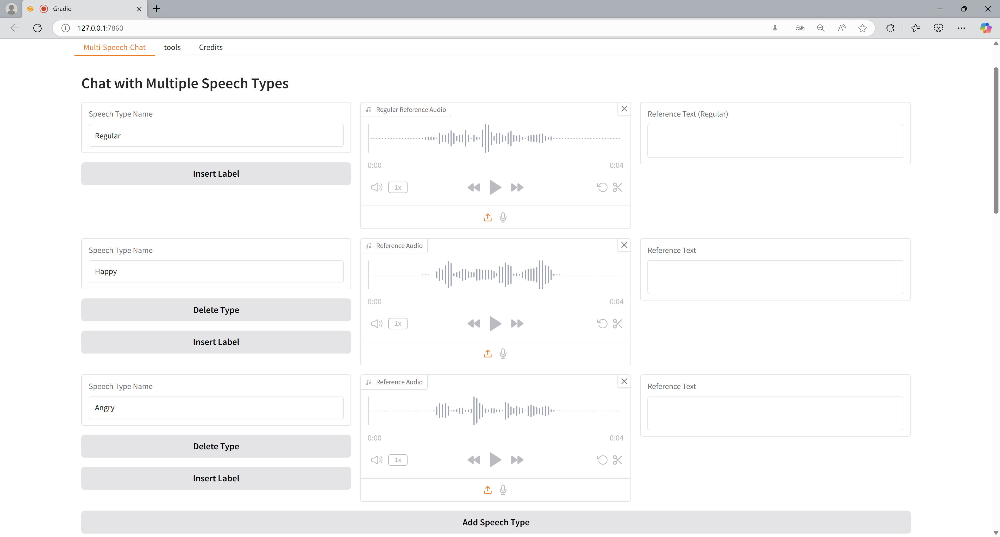
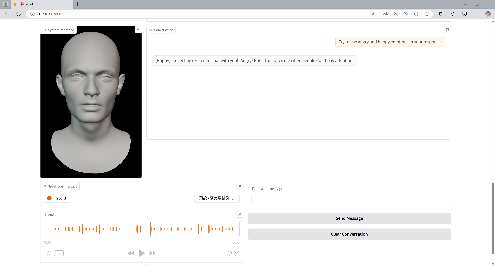

# Emotionally Customizable ChatBot
Chatting with chatgpt feels good, but sometimes the voice might be too flat or not emotional enough. Maybe it would be instresting if we can customize the voice response. 

This project combines the feature of multistyle-speech in **f5-tts**, LLM(using **chatgpt api**), and **EmoTalk** talking face.

With text or audio input, we can get customized audio response with different emotions from our customized settings. Moreover, we can get an emotional talking face video output with the emotion of the audio response.

## Demo
<p align="center">
    <br>
    
    <br>
</p>
First, input your voice file with emotion tags. The f5-tts model will clone the voice for response audio.

<p align="center">
    <br>
    
    <br>
</p>
Then, you can chat with chatgpt using your customized voice. Multiple voice response is available as well.

---
### Customized blendshape model
You can use your own blendshape model as the video output, just put your `xxx.blend` under `./EmoTalk_release`.

Note that the blendshape model should be rigged with 52 arkit shape key, and `run_emo.py` and `render_mm.py` will need to be modified as needed.

## Environment
Set the conda environment used in [f5-tts](https://github.com/SWivid/F5-TTS), and download all the requirements in [f5-tts](https://github.com/SWivid/F5-TTS) and [EmoTalk](https://github.com/psyai-net/EmoTalk_release).  

Put the files in correct directories.

**The final directories should be like this.**
```
> root_dir (f5-tts_root)
    > DATA
        > input_audio
        > output_EmoTalk
    > run_emo.py
    > EmoTalk_release
        > (other files in EmoTalk)
        > create_bs_face.py
        > render_mm.py
    > src (in f5-tts)
        > f5_tts
            > infer
                > (other files in this dir)
                > infer_mm.py
    > (other files in f5-tts_root)    
```

## Inference
Fill in your openai api key in `infer_mm.py`.

Run the following command under root_dir to infer in gradio.
```
python src/f5_tts/infer/infer_mm.py
```
